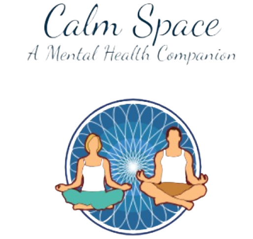

  

# CALM SPACE
  ewewuiwruwryeuireyuiryueyureuyrewyufuydshjfdhjsfjhsdjhfdsjhfjhsjhfwhrioworosfojksfklshfakjhfjhafhkjsbdfkdjsbfsjdkgjsdghjsdkjghbdswkfgsdbfskjfbsfjskjfbdjkfbjsdfkjsbfak
 

## Table of Contents
-  [1. Project Overview](#proj-ov)
-  [2. Objectives](#obj)
-  [3. Members](#memb)

## <a id = "proj-ov"> 🎯 Project Overview </a>  
 - Mental health has a great impact to every individual and to the society, most people don't want to talk about their personal struggles while some just don't really have anyone to talk to. The development of this mobile mental health companion application that will try to help and assist people of different ages especially the students to somehow cope with their silent battles and mental health challenges. The project aims to offer an application where people can have a safe space to freely pour out their thoughts and feelings without any judgement. The application will also include a mood tracking feature that will enable them to reflect with their daily emotions and know how they will improve themselves. The third feature is the coping tips which will contaion different guided meditation, exercise, and self-care tips to somehow ease the heavy feeling of the users.
 This project is conducted in accordance with the Sustainable Development Goal's, Good health, and well being. Additionally, the components of the application does not necessarily claim that it will solve all the challenges brought by mental health problems since they may still be subject to further examinations, studies, and professional consultations in order to assure it's effectiveness.
  

##  <a id = "obj"> 📈 Objective </a> 

- <b> 1 </b>: To help people cope with mental health challenges and prevent the increasing cases of suicidal incidents.   

- <b> 2 </b>: To offer resources that are beneficial for mental health awareness and addressment.   

- <b> 3 </b>: To provide a safe and judgement-free space.   

##  <a id = "memb"> 👷‍ Members </a>  

| Name | E-mail |
| --- | --- |
| <a href = "https://www.facebook.com/jefferson.devilla.04"> De Villa, Jefferson A. </a>| 21-05574@g.batstate-u.edu.ph |
| <a href = "https://www.facebook.com/laudeffenette.devilla"> De Villa, Laudefinette M. </a>| 21-00581@g.batstate-u.edu.ph |
| <a href = "https://www.facebook.com/YaziRayz"> Lipata, Riazel A. </a>| 21-02830@g.batstate-u.edu.ph |
| <a href = "https://www.facebook.com/philip.asilo"> Nuñez, John Philip A. </a>| 21-07931@g.batstate-u.edu.ph |

 

- Course:
  - IT 331 (Application Development and Emerging Technologies)
- Course Facilitator:
  - Fatima Marie Agdon